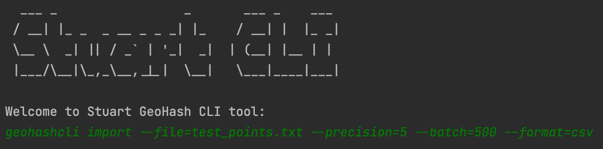

# :globe_with_meridians: Unique Geohash :globe_with_meridians:

Your task is to transform the set of longitude, latitude coordinates provided in the test_points.txt.gz file into corresponding GeoHash (https://en.wikipedia.org/wiki/Geohash) codes. For each pair of coordinates only the shortest geohash prefix that uniquely identifies this point must be stored. For instance, the 3 points dataset below would store

|latitude        | longitude       | geohash      | unique_prefix |
|----------------|-----------------|--------------|---------------|
|41.388828145321 | 2.1689976634898 | sp3e3qe7mkcb | sp3e3         |
|41.390743       | 2.138067        | sp3e2wuys9dr | sp3e2wuy      |
|41.390853       | 2.138177        | sp3e2wuzpnhr | sp3e2wuz      |

So for the set of points in `test_points.txt.gz` provide the precomputed unique_prefix each point belongs to.

The solution must be coded in `Scala` or `Java` and you can use any public domain libraries. It should work with any unseen file respecting the same schema than the ones provided. The executable must output in stdout the solution in csv format with 4 columns following the structure of the example, ie:

```csv
lat,lng,geohash,uniq
41.388828145321,2.1689976634898,sp3e3qe7mkcb,sp3e3
41.390743,2.138067,sp3e2wuys9dr,sp3e2wuy
41.390853,2.138177,sp3e2wuzpnhr,sp3e2wuz
```

## :nerd_face: We value in the solution
- Code with proper documentation
- Reasonable test coverage
- Good software design
- General documentation explaining usage and design decisions
- Opportunities for parallelizing the solution
- Clever but justified usage of tailored data structures
- Command line helpers and user friendlyness
- Building instructions if required

## :briefcase: Solution
You can find the detailed description of the developed solution on the Solution page. 
Here is a brief preview of what you will find on the [Solution](docs/Solution.md) page.

### :arrow_right: Table of contents
- [Requirements](https://github.com/StuartHiring/scala-test-llfrometa89/blob/master/docs/Solution.md#requirements)
- [Terminology](https://github.com/StuartHiring/scala-test-llfrometa89/blob/master/docs/Solution.md#terminology)
- [Solution](https://github.com/StuartHiring/scala-test-llfrometa89/blob/master/docs/Solution.md#solution)
    - [Package structure](https://github.com/StuartHiring/scala-test-llfrometa89/blob/master/docs/Solution.md#package-structure)
    - [Libraries](https://github.com/StuartHiring/scala-test-llfrometa89/blob/master/docs/Solution.md#libraries)
    - [Parallelization](https://github.com/StuartHiring/scala-test-llfrometa89/blob/master/docs/Solution.md#parallelization)
- [Architecture Decision Records](https://github.com/StuartHiring/scala-test-llfrometa89/blob/master/docs/Solution.md#architecture-decision-records)
- [Testing](https://github.com/StuartHiring/scala-test-llfrometa89/blob/master/docs/Solution.md#testing)
- [Building](https://github.com/StuartHiring/scala-test-llfrometa89/blob/master/docs/Solution.md#building)
- [Running Stuart GeoHash CLI](https://github.com/StuartHiring/scala-test-llfrometa89/blob/master/docs/Solution.md#running-stuart-geohash-cli)
- [Supporting IntelliJ IDEA](https://github.com/StuartHiring/scala-test-llfrometa89/blob/master/docs/Solution.md#running-stuart-geohash-cli)
- [Known issue](https://github.com/StuartHiring/scala-test-llfrometa89/blob/master/docs/Solution.md#known-issue)
- [How to contribute](https://github.com/StuartHiring/scala-test-llfrometa89/blob/master/docs/Solution.md#how-to-contribute)

### :clapper: Spoiler alert!
Here is a first look at what the developed command line application looks like.


