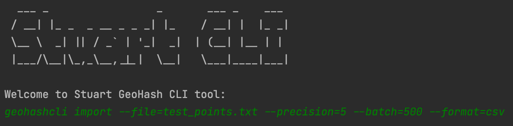

# Stuart GeoHash
The code challenge was very interesting, it helps you open your mind and 
make decisions thinking to solve current and future problems. For the 
development of the solution, I have used Scala as the main language, and 
the [Typelevel](https://typelevel.org/) ecosystem using famous functional 
libraries in the Scala community like [Cats](https://typelevel.org/cats/),
and [Cats-Effect 3](https://typelevel.org/cats-effect/docs/getting-started) (aka CE3), 
among other libraries that work in perfect synergy with CE3. A command line application
has been developed to support the exercise. You can find more details in the 
following sections.

## Table of contents
- [Terminology](https://github.com/StuartHiring/scala-test-llfrometa89/blob/master/docs/Solution.md#terminology)
- [Solution](https://github.com/StuartHiring/scala-test-llfrometa89/blob/master/docs/Solution.md#solution)
  - [Package structure](https://github.com/StuartHiring/scala-test-llfrometa89/blob/master/docs/Solution.md#package-structure)
  - [Libraries](https://github.com/StuartHiring/scala-test-llfrometa89/blob/master/docs/Solution.md#libraries)
  - [Parallelization](https://github.com/StuartHiring/scala-test-llfrometa89/blob/master/docs/Solution.md#parallelization)
- [Architecture Decision Records](https://github.com/StuartHiring/scala-test-llfrometa89/blob/master/docs/Solution.md#architecture-decision-records)
- [Testing](https://github.com/StuartHiring/scala-test-llfrometa89/blob/master/docs/Solution.md#testing)
- [Building](https://github.com/StuartHiring/scala-test-llfrometa89/blob/master/docs/Solution.md#building)
- [Running Stuart GeoHash CLI](https://github.com/StuartHiring/scala-test-llfrometa89/blob/master/docs/Solution.md#running-stuart-geohash-cli)
- [Supporting IntelliJ IDEA](https://github.com/StuartHiring/scala-test-llfrometa89/blob/master/docs/Solution.md#running-stuart-geohash-cli)
- [Known issue](https://github.com/StuartHiring/scala-test-llfrometa89/blob/master/docs/Solution.md#known-issue)
- [How to contribute](https://github.com/StuartHiring/scala-test-llfrometa89/blob/master/docs/Solution.md#how-to-contribute)


### Terminology
- `F[_]` is a functional programming feature called type constructor used in higher kinded type definition.
  I recommend you check the following [article](https://www.47deg.com/blog/what-is-F-with-hole-in-scala/#what-is-a-type-constructor-_-or-a-higher-kinded-type-2)
- `Sync`, `Async`, `IO` are Typeclases and data types from Typelevel ecosystem.
  In case you are not familiar with the Cats-Effect 3 library or have worked with Cats-Effect 2,
  you may be interested in reviewing the [migration guide](https://typelevel.org/cats-effect/docs/migration-guide) 
  to establish some concepts included such as `IORuntime` and the new thread model implemented.

### Solution
The solution includes some aspects related to the development of software thought
of maintainability, organization, documentation,  and good test testing that provides
a plus in the future evolution of the component. I have used an approach oriented 
to Domain Driven Design, which for the proposed code challenge can be an overhead 
but it provides some important aspects in terms of organization and maintainability
of the solution that I wanted to introduce. I have separated the solution in the 
following layers such as `Domain`, `Application` and `Infrastructure`,
which I will explain in the **Package structure** section.

#### Package Structure
The package structure follows the market standard based on Domain Driven Development.
```
[com.stuart.geohash]
├── application
│   └── services            # Application services is the place to implement the case of uses
├── domain
│   ├── models              # Domain models
│   └── repositories        # Repository definition
├── infrastructure
│   └── configuration       
│   ├── db                  
│       ├── client          # Data access
│       └── liquibase       # Database version control for your database
│   ├── repositories        # Repository implementation
│   ├── ioc                 
│       └── providers       # Dependency injection 
│   └── stdio               # Console commands, helpers and console output format supported like json and csv
└── Main.scala
```
#### Libraries
I have been using many libraries for the development of the solution, among the ones 
that I would most like to comment on due to the value they bring to the solution are 
the following:
- `Cats` - Provide abstractions for functional programming in Scala. [docs](https://typelevel.org/cats/)
- `Cats-Effect` - The IO Monad for Scala, plus type classes for general effect types.  [docs](https://typelevel.org/cats-effect/docs/getting-started)
- `scalafmt` - Scalafmt keep the same code style among all contributors. [docs](https://scalameta.org/scalafmt/docs/installation.html)
- `scalatest` - ScalaTest is the most flexible and most popular testing tool in 
  the Scala ecosystem.  [docs](https://www.scalatest.org/)
- `testcontainer` - TestContainer allows Dockerize your integration tests and make it as close
  to production in terms of infrastructure versions used. [docs](https://www.testcontainers.org/)
- `liquibase` - Track, version, and deploy database changes. [docs](https://www.liquibase.org/)
- `refined` - it's a Scala library for refining types with type-level predicates which constrain the 
  set of values described by the refined type. [docs](https://github.com/fthomas/refined)
- `doobie` - it's a pure functional JDBC layer for Scala and Cats. nor is it a relational algebra; it simply 
  provides a functional way to construct programs (and higher-level libraries) that use JDBC. [docs](https://tpolecat.github.io/doobie/)

#### Parallelization
Cats-Effect 3 has included a rich and efficient threading model to support freezing and concurrency solutions using thread pools.
It makes use of a simple Fibers model where you have physical and virtual threads to achieve high performance.
I don't think I have enough time to complete this approach but in the following link you will find valuable information about it.
- [Concurrency in Cats Effect 3](https://typelevel.org/blog/2020/10/30/concurrency-in-ce3.html)
- [Why are Fibers fast?](https://typelevel.org/blog/2021/02/21/fibers-fast-mkay.html)

### Architecture Decision Records
An Architecture Decision Record (ADR) is a document that captures a decision, including the context of how the decision
was made and the consequences of adopting the decision. You can find the ADR to answer some questions about the solution
in the following document.

#### How do you can contribute to create ADRs?
- It's simple, please copy/paste the defined [template](adrs/template.md) and complete the sections.
#### ADRs (examples)
- [Initial Stuart GeoHash CLI tool definition](adrs/1.initial-component-definition.md)
- [Choose mysql as main storage](adrs/2.choose-mysql-as-main-database.md)
- [Introduce a Kafka message broker](adrs/3.introduce-a-kafka-message-broker.md)

### Testing
> Note that, thanks to test-containers, you don't need any infrastructure component to run integration test on
> your local environment

To run Unit Tests execute:
```sh
./sbt test
```
To run Integration Tests execute:
```sh
./sbt it:test
```
### Building
```sh
./sbt stage
```
### Running Stuart GeoHash CLI
#### Available command
- Import geopoint to generate geohash
```sh
geohashcli import --file=test_points.txt --precision=5 --batch=500 --format=csv
```
- `file` filename of the file in `csv` format
- `precision` is the value to set in the geohash generation process. 
- `format` = `json` | `csv`.It's means the console output int this iteration.
- `batch` batch size
#### Help command
```sh
geohashcli help
```
#### How do it look like?


### Supporting IntelliJ IDEA
The requeded `env` variables should be found in `.env` file. For didactic purposes, 
this is made available but in a real application THIS SHOULD NEVER BE MADE PUBLIC.
You should configure the `env` variables in IntelliJ IDEA for running and debugging mode.
In other case the application won't execute.

#### Instructions
- Open edit Run/Debug configuration dialog

   
- Click in the red rectangle in order to configure the environment variables 

   
- Add the environment variables required

   
### Known issue

The red messages when the application start belongs to a unknown issue of the `liquibase` library.
I tried to control the log level in the `logback.yml` file but the message continue. In further
version should be fixed.

### How to contribute
- For major or architectural contributions, please contact the domain team in order to set an agreement.
- For minor contributions, just open a pull request from your feature branch to master and wait for 
  2 approvals from the code owners.
- We should use **squash-and-merge**, in order to generate one commit per feature into  master branch. 
  When merging the squashed commit, please follow the [conventional commits standard](Conventional Commits).
