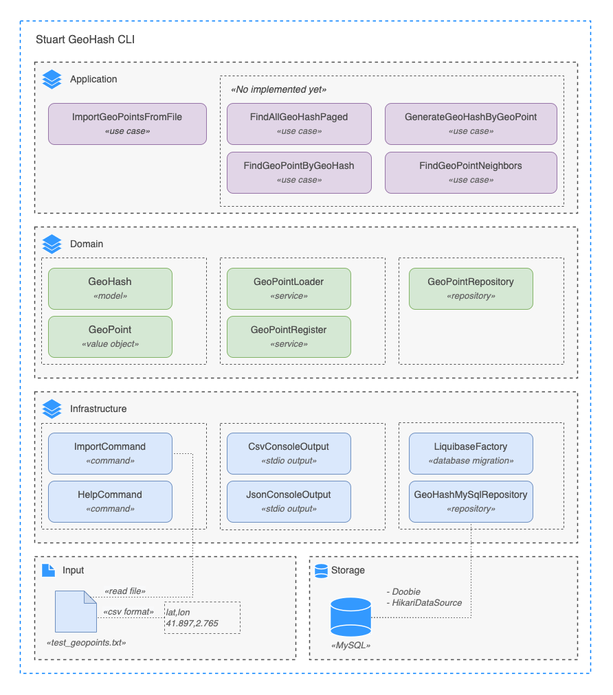

# Stuart GeoHash
The code challenge was very interesting, it helps you open your mind and make decisions thinking to solve current and
future problems. For the development of the solution, I have used Scala as the main language, and the [Typelevel](https://typelevel.org/)
ecosystem using famous functional libraries in the Scala community like [Cats](https://typelevel.org/cats/), 
and [Cats-Effect 3](https://typelevel.org/cats-effect/docs/getting-started) (aka CE3), among other libraries that work in 
perfect synergy with CE3. A command line application has been developed to support the exercise. You can find more details
in the following sections.

## Table of contents
- [Requirements](https://github.com/llfrometa89/poc-scala-geohash/blob/master/docs/Solution.md#requirements)
- [Terminology](https://github.com/llfrometa89/poc-scala-geohash/blob/master/docs/Solution.md#terminology)
- [Solution](https://github.com/llfrometa89/poc-scala-geohash/blob/master/docs/Solution.md#solution)
  - [Package structure](https://github.com/llfrometa89/poc-scala-geohash/blob/master/docs/Solution.md#package-structure)
  - [Libraries](https://github.com/llfrometa89/poc-scala-geohash/blob/master/docs/Solution.md#libraries)
  - [Parallelization](https://github.com/llfrometa89/poc-scala-geohash/blob/master/docs/Solution.md#parallelization)
  - [Implemented algorithm](https://github.com/llfrometa89/poc-scala-geohash/blob/master/docs/Solution.md#implemented-algorithm)
- [Architecture Decision Records](https://github.com/llfrometa89/poc-scala-geohash/blob/master/docs/Solution.md#architecture-decision-records)
- [Checking code format](https://github.com/llfrometa89/poc-scala-geohash/blob/master/docs/Solution.md#checking-code-format)
- [Testing](https://github.com/llfrometa89/poc-scala-geohash/blob/master/docs/Solution.md#testing)
- [Building and packaging](https://github.com/llfrometa89/poc-scala-geohash/blob/master/docs/Solution.md#building-and-packaging)
- [Running Stuart GeoHash CLI](https://github.com/llfrometa89/poc-scala-geohash/blob/master/docs/Solution.md#running-stuart-geohash-cli)
- [Supporting IntelliJ IDEA](https://github.com/llfrometa89/poc-scala-geohash/blob/master/docs/Solution.md#running-stuart-geohash-cli)
- [Known issue](https://github.com/llfrometa89/poc-scala-geohash/blob/master/docs/Solution.md#known-issue)
- [How to contribute](https://github.com/llfrometa89/poc-scala-geohash/blob/master/docs/Solution.md#how-to-contribute)


### Requirements
- Install `sbt` 1.7.x or later. Also, you can use the [sbt-extra](https://raw.githubusercontent.com/dwijnand/sbt-extras/master/sbt) 
  tool present in this repository-e.g `~$ ./sbt compile`
- Install `java` 11 or later. Yeah, this component is compatible with `Java 17` in the LTS version `Eclipse Adoptium Java 17.0.3` 
- Install `docker` 20.10.x or later. Visit the [Install Docker Engine](https://docs.docker.com/engine/install/) page in
  order to check the `Supported platforms`.
- Install MySQL server version 8.x.x or later

### Terminology
- `F[_]` is a `type parameter` witch is self a `type constructor` used in `higher kinded type` definition. I recommend 
  you check the following [article](https://www.47deg.com/blog/what-is-F-with-hole-in-scala/#what-is-a-type-constructor-_-or-a-higher-kinded-type-2)
  in order to enter in deep or refresh the concept.
- `Sync`, `Async`, `IO` are type classes and data types from Typelevel ecosystem. In case you are not familiar with the 
  Cats-Effect 3 library or have worked with Cats-Effect 2, you may be interested in reviewing the [migration guide](https://typelevel.org/cats-effect/docs/migration-guide) 
  to establish some concepts included such as `IORuntime` and the new thread model implemented.
- **Refined types** are types with type-level predicates which constrain the set of values described.
- Scala `LazyList` is a type that implements an immutable linked list, that means the computes its elements only when 
  they are needed. [docs](https://www.scala-lang.org/api/2.13.x/scala/collection/immutable/LazyList.html)

### Solution
The solution includes some important aspects related to the software development like is of maintainability, organization,
documentation,  and good test coverage both unit and integration test, which provides a plus in the future evolution of 
the component. I have used an approach oriented to Domain Driven Design, which for the proposed code challenge can be an
overhead but it provides some important aspects in terms of organization and maintainability of the solution that I wanted
to introduce in the solution. I have separated the solution into the following layers such as `Domain`, `Application`and
`Infrastructure`, which I will explain in the **Package structure** section.

#### Component overview



#### Package Structure
The package structure follows the market standard based on Domain Driven Development.
```
[com.stuart.geohash]
├── application
│   └── services            # Application services is the place to implement the case of uses
├── domain
│   ├── models              # Domain models
│   └── repositories        # Repository definition
├── infrastructure
│   └── configuration       
│   ├── db                  
│       ├── client          # Data access
│       └── liquibase       # Database version control
│   ├── repositories        # Repository implementation
│   ├── ioc                 
│       └── providers       # Dependency injection 
│   └── stdio               # Console commands, helpers and console output format supported like json and csv
└── Main.scala
```
#### Libraries
I have been using many libraries for the development of the solution, among the ones 
that I would most like to comment on due to the value they bring to the solution are 
the following:
- `Cats` - Provide abstractions for functional programming in Scala. [docs](https://typelevel.org/cats/)
- `Cats-Effect` - The IO Monad for Scala, plus type classes for general effect types.  [docs](https://typelevel.org/cats-effect/docs/getting-started)
- `scalafmt` - Scalafmt keep the same code style among all contributors. [docs](https://scalameta.org/scalafmt/docs/installation.html)
- `scalatest` - ScalaTest is the most flexible and most popular testing tool in 
  the Scala ecosystem.  [docs](https://www.scalatest.org/)
- `testcontainer` - TestContainer allows Dockerize your integration tests and make it as close
  to production in terms of infrastructure versions used. [docs](https://www.testcontainers.org/)
- `liquibase` - Track, version, and deploy database changes. [docs](https://www.liquibase.org/)
- `refined` - it's a Scala library for refining types with type-level predicates which constrain the 
  set of values described by the refined type. [docs](https://github.com/fthomas/refined)
- `doobie` - it's a pure functional JDBC layer for Scala and Cats. nor is it a relational algebra; it simply 
  provides a functional way to construct programs (and higher-level libraries) that use JDBC. [docs](https://tpolecat.github.io/doobie/)
- `geohash` - Java code for geohashes [docs](https://github.com/kungfoo/geohash-java)
- `newtype` - NewTypes for Scala with no runtime overhead. [docs](https://github.com/estatico/scala-newtype)

#### Parallelization
Cats-Effect 3 has included a rich and efficient threading model to support freezing and concurrency solutions using thread pools.
It makes use of a simple Fibers model where you have physical and virtual threads to achieve high performance.
In the following link you will find valuable information about this topic.
- [Concurrency in Cats Effect 3](https://typelevel.org/blog/2020/10/30/concurrency-in-ce3.html)
- [Why are Fibers fast?](https://typelevel.org/blog/2021/02/21/fibers-fast-mkay.html)

##### Implemented algorithm


- **Load file**: Load files in batch defined by `batchSize` into `LazyList` structure. You can find more information here 
  regarding [LazyList](https://www.scala-lang.org/api/2.13.x/scala/collection/immutable/LazyList.html). The file should be 
  in csv format. -e.g like `test_geopoints.txt` file.
- **Filter duplicated geopoints**: This step allows filtering duplicate lines to improve database performance access.
- **Process geopoints in batch**: Here the algorithm is using the `Parallel` type class and `.parTraverse_` method
  to save the GeoHash into the database.

For the solution I have used the type class [Parallel](https://typelevel.org/cats/typeclasses/parallel.html), `cats.Parallel`,
and the `.parTraverse_` method. I am using the Thread pool created by `IORuntime` instance the `IOApp` main class. The command line
is printing using three main functions: 
- `onBatchFinish: BatchResult => F[Unit]` is called by for finished batch
- `onStart: FiniteDuration => F[Unit]` is called when the process start
- `onFinish: ExecutionResult => F[Unit]`  is called when the process start
 
Here you can see an example with the command output after the process was completed.
```sh
  ___ _                 _       ___ _    ___ 
 / __| |_ _  _ __ _ _ _| |_    / __| |  |_ _|
 \__ \  _| || / _` | '_|  _|  | (__| |__ | | 
 |___/\__|\_,_\__,_|_|  \__|   \___|____|___|
 
Welcome to Stuart GeoHash CLI tool:
geohashcli import --file=test_points.txt --precision=5 --batch=500 --format=csv

Starting process at 2022-08-20T03:18:14.166
lat,lng,geohash,uniq
41.37484808,2.11886538,sp3e2hncvnsw,sp3e2
41.37438124,2.11842003,sp3e25yx4z8m,sp3e2
41.3806658,2.1647467,sp3e3m07f70n,sp3e3
The import process has been finished at 2022-08-20T03:24:05.547

------------------------ Execution summary ------------------------ 
Start time: 2022-08-20T03:56:58.652
Finish time: 2022-08-20T04:06:36.319
Total lines: 100000
Number of lines to process: 93625
Duplicated lines: 6375
Count of batches: 188
Batch size: 500
Total execution time: 9min
Count of errors: 3
------------------------------------------------------------------- 
```

### Architecture Decision Records
An Architecture Decision Record (ADR) is a document that captures a decision, including the context, decisions and the 
consequences of adopting the decision. This is the way that I propose to keep the light(KLO)  the component, and its 
future evolution in terms of architecture. That is a good way to provide context to the current and future members and 
make easy onboarding and take future decisions. Then raise your hand and find a consensus in the team and required persons.

#### How do you can contribute to create ADRs?
- It's simple, please copy/paste the defined [template](adrs/template.md) and complete the sections.

#### ADRs (examples)
- [Initial Stuart GeoHash CLI tool definition](adrs/1.initial-component-definition.md)
- [Choose mysql as main storage](adrs/2.choose-mysql-as-main-database.md)
- [Introduce a Kafka message broker](adrs/3.introduce-a-kafka-message-broker.md)

### Checking code format
I am using `scalafmt` sbt plugin to keep the same code style among all contributors. You can find more information in the
[official documentation](https://scalameta.org/scalafmt/docs/installation.html).
  ```sh
./sbt scalafmtSbtCheck scalafmtCheckAll
```
### Testing
> Note that, thanks to testcontainers, you don't need any infrastructure component to run integration test on your local 
> environment.

#### To run Unit Tests execute:
```sh
./sbt test
```
#### To run Integration Tests execute:
```sh
./sbt it:test
```
#### Test coverage
```sh
./sbt coverage test it:test coverageOff coverageReport
```
More information related to this topic, check the [official documentation](https://github.com/scoverage/sbt-scoverage)

### Building and packaging
```sh
./sbt stage
```
you can find the executable in the following path `target/universal/stage/bin/geohash`.
### Running Stuart GeoHash CLI
#### Available command
- Import geopoint to generate geohash
```sh
$ geohashcli import --file=test_points.txt --precision=5 --batch=500 --format=csv
```
- `--file` filename of the file in `csv` format
- `--precision` = Valid value should be in the following range `1` to `12`. 
  calculated based on the shortest GeoHash prefix that uniquely identifies this point.
- `--format` = `json` | `csv`.It's means the console output int this iteration.
- `--batch` batch size by defaul is `100`
#### Help command
```sh
$ geohashcli --help
usage: geohashcli [command] [options] [target [target2 [target3] ...]]
 -b,--batch <arg>       Allow to set batch value
 -f,--file <arg>        Allow to set file address
 -fmt,--format <arg>    Allow to set file format
 -help,--help           Execute help command
 -import,--import       Execute import command
 -p,--precision <arg>   Allow to set geohash precision
```
#### Running
> Keep in mind you need a MySQL server running before run the Stuart GeoHash CLI. 
> You can use the following on-demand docker to didactic purpose:
> `docker run --name mysql -e MYSQL_ROOT_PASSWORD=root -p 3315:3306 -d mysql:8.0.30`

After **Building and packaging** step you has available the executable in `target/universal/stage`.
Then export the variables present in `.env` file. For didactic purposes,
this is made available but in a real application THIS SHOULD NEVER BE MADE PUBLIC.
```sh
export DB_MYSQL_JDBC_URL=[DB_MYSQL_JDBC_URL]
export DB_MYSQL_USER=[DB_MYSQL_USER]
export DB_MYSQL_PASSWORD=[DB_MYSQL_PASSWORD]
export DB_MYSQL_MAXIMUM_POOL_SIZE=[DB_MYSQL_MAXIMUM_POOL_SIZE]
```
Now run the following command and write your command here.
```
~/target/universal/stage$ ./bin/geohash
  ___ _                 _       ___ _    ___ 
 / __| |_ _  _ __ _ _ _| |_    / __| |  |_ _|
 \__ \  _| || / _` | '_|  _|  | (__| |__ | | 
 |___/\__|\_,_\__,_|_|  \__|   \___|____|___|
 
Welcome to Stuart GeoHash CLI tool:
geohashcli --help
usage: geohashcli [command] [options] [target [target2 [target3] ...]]
 -b,--batch <arg>       Allow to set batch value
 -f,--file <arg>        Allow to set file address
 -fmt,--format <arg>    Allow to set file format
 -help,--help           Execute help command
 -import,--import       Execute import command
 -p,--precision <arg>   Allow to set geohash precision
```
**Note**: All initialize structure like database structure are manage by the [Liquibase](https://www.liquibase.org/) dependency 

### Supporting IntelliJ IDEA
The required `env` variables should be found in `.env` file. For didactic purposes, 
this is made available but in a real application THIS SHOULD NEVER BE MADE PUBLIC.
You should configure the `env` variables in IntelliJ IDEA for running and debugging mode.
In other case the application won't execute.

#### Instructions
- Open edit Run/Debug configuration dialog


- Click in the red rectangle in order to configure the environment variables


- Add the environment variables required


### Known issue

The red messages when the application start belongs to a unknown issue of the `liquibase` library.
I tried to control the log level in the `logback.yml` file but the message continue. In further
version should be fixed.

### How to contribute
This is the way that I propose to contribute to the project code and its future evolution. It's just an example but 
its should be a team agreement.
- For major or architectural contributions, please contact the domain team in order to set an agreement.
- For minor contributions, just open a pull request from your feature branch to master and wait for 
  2 approvals from the code owners.
- We should use **squash-and-merge**, in order to generate one commit per feature into  master branch. 
  When merging the squashed commit, please follow the [conventional commits standard](Conventional Commits).
